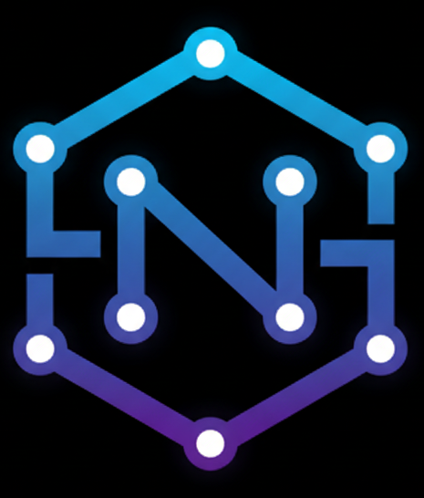

# 🚀 Nexus Framework

-brightgreen>)


**Nexus** é um **microframework PHP moderno**, projetado para desenvolvedores que constroem **sistemas sob medida**, **APIs escaláveis** e **aplicações web profissionais**.  
Seu foco está em **produtividade**, **organização arquitetural** e **manutenção a longo prazo**, evitando a complexidade desnecessária de frameworks monolíticos.

---

## 🎯 Objetivos do Framework

- 🔹 Acelerar o desenvolvimento de aplicações PHP profissionais
- 🔹 Padronizar a arquitetura em projetos sob medida
- 🔹 Facilitar manutenção, evolução e escalabilidade
- 🔹 Separação clara entre **Web**, **API** e **Domínio**
- 🔹 Código limpo, previsível e orientado a boas práticas

---

## 🧱 Arquitetura

O **Nexus Framework** adota uma arquitetura **MVC Modular**, baseada em princípios consolidados de engenharia de software:

- **Clean Architecture**
- **SOLID**
- **Object Calisthenics**
- **DDD pragmático**

A estrutura foi desenhada para garantir **baixo acoplamento**, **alta coesão** e **evolução contínua** do código.

---

## 🛠️ Stack Tecnológica

- **PHP 8.1+**
- **MySQL / MariaDB**
- **Tailwind CSS**
- **Arquitetura MVC personalizada**
- **Microframework artesanal**
- **Configuração por ambiente (.env)**

---

## 📂 Estrutura de Diretórios

```bash
/
├─ app/
│  ├─ controller/
│  │  ├─ Core.Controller.php
│  │  ├─ Email.Controller.php
│  │  └─ Log.Controller.php
│  ├─ migration/
│  │  ├─ 001_create_migrations_table.sql
│  │  ├─ 002_create_users.sql
│  │  ├─ 003_create_roles.sql
│  │  ├─ 004_create_user_roles.sql
│  │  └─ 005_create_audit_logs.sql
│  ├─ model/
│  │  ├─ Core.class.php
│  │  ├─ Kernel.class.php
│  │  ├─ Ligacao.class.php
│  │  ├─ Log.class.php
│  │  ├─ MigrateCommand.class.php
│  │  ├─ MigrateFreshCommand.class.php
│  │  ├─ Migration.class.php
│  │  ├─ SeedCommand.class.php
│  │  └─ StartCommand.class.php
│  ├─ route/
│  │  ├─ api.php
│  │  └─ web.php
│  ├─ seeds/
│  │  ├─ 001_seed_roles.sql
│  │  ├─ 002_seed_admin_user.sql
│  │  └─ 003_seed_user_roles.sql
│  ├─ service/
│  ├─ src/
│  │  ├─ components/
│  │  ├─ css/
│  │  ├─ fonts/
│  │  ├─ images/
│  │  └─ js/
│  └─ view/
├─ bootstrap/
│  └─ cli.php
├─ resource/
│  ├─ data/
│  │  └─ consultas.sql
│  └─ envexemple.php // altera para env.php
├─ storage/
│  ├─ cache/
│  └─ logs/
│  └─ autoload.php
```

## 🧩 Camadas do Sistema

O **Nexus Framework** adota uma arquitetura **MVC Modular**, baseada em princípios consolidados de engenharia de software:

### 📌 Controller

- **Recebe e valida requisições**
- **Converte dados de entrada**
- **Delegação total para a camada de Service**

### 📌 Service

- **Implementa regras de negócio**
- **Orquestra fluxos da aplicação**
- **Comunica-se com Repository e DTOs**

### 📌 Repository

- **Centraliza acesso a dados**
- **Isola queries SQL**
- **Facilita manutenção e testes**

### 📌 DTO (Data Transfer Object)

- **Padroniza transporte de dados**
- **Evita acoplamento entre camadas**
- **Garante consistência de dados**

### 📌 View & Components

- **Views desacopladas da lógica**
- **Componentes reutilizáveis**
- **Integração nativa com Tailwind CSS**

## ⚙️ Configuração de Ambiente

- **Pré-requisitos**
- **PHP 8.1+**
- **MySQL ou MariaDB**
- **Apache ou Nginx**
- **XAMPP ou DOCKER**

## 🔐 Licença

Este projeto é proprietário.
O uso, redistribuição ou modificação do **Nexus Framework** depende de autorização expressa do autor.

## 🧠 Público-Alvo

- **Desenvolvedores PHP**
- **Freelancers e agências**
- **Empresas que desenvolvem software sob medida**
- **Projetos que exigem controle total da arquitetura**

## 👨‍💻 Autor

Paulo Fernando Ferreira Pires
Empreendedor & Desenvolvedor Full Stack
Especialista em arquitetura PHP e sistemas sob medida

🌐 https://www.paulodevelop.com

## 🔮 Roadmap

- [x] **CLI oficial do Nexus (Basic)**
- [] **Middleware HTTP**
- [] **Autenticação JWT nativa**
- [] **Camada de Events & Listeners**
- [] **Documentação oficial**
